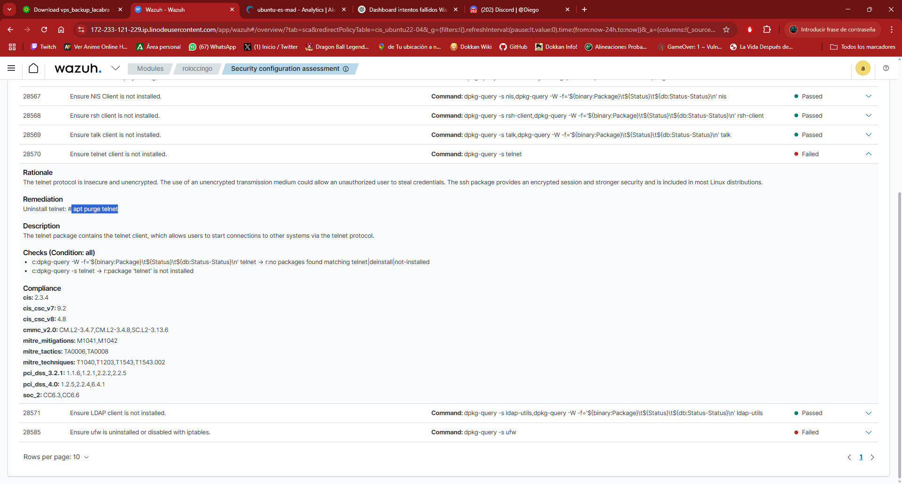
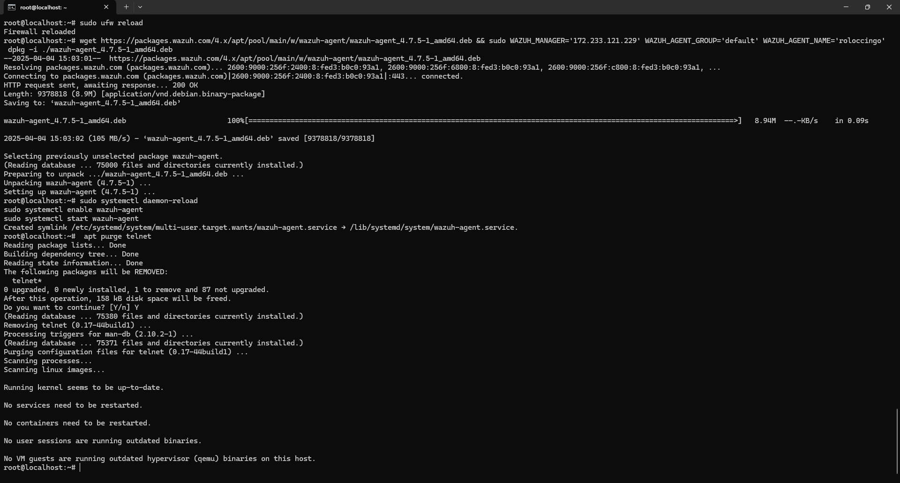
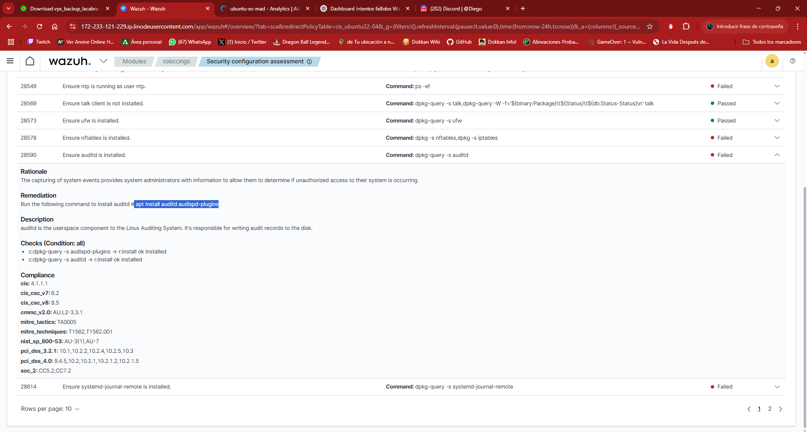
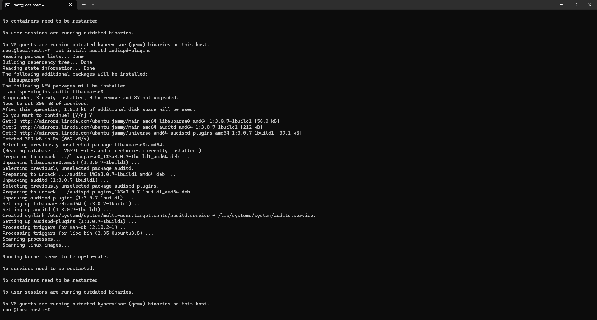
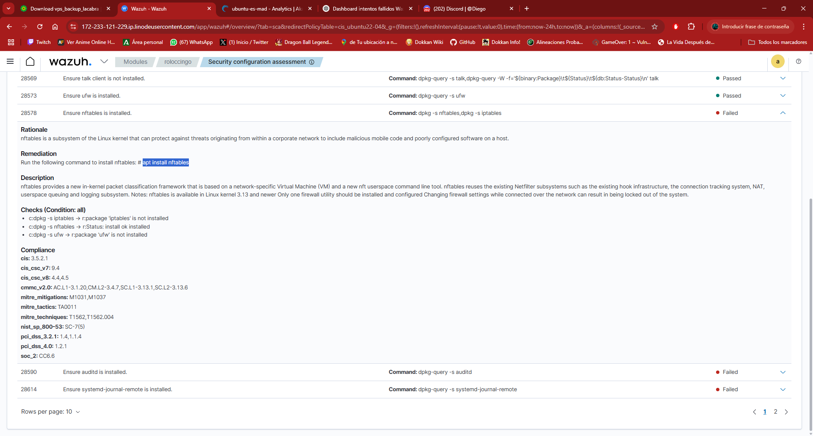
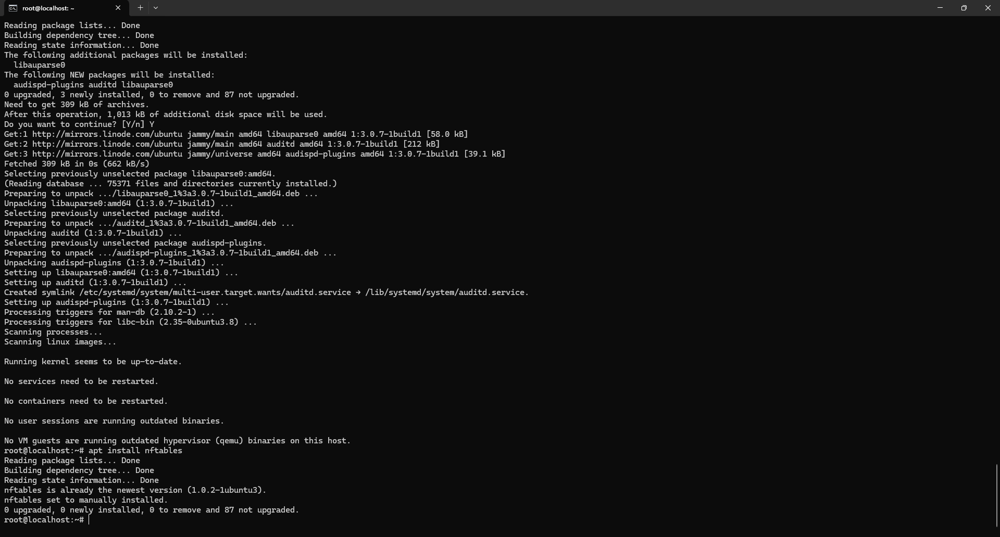
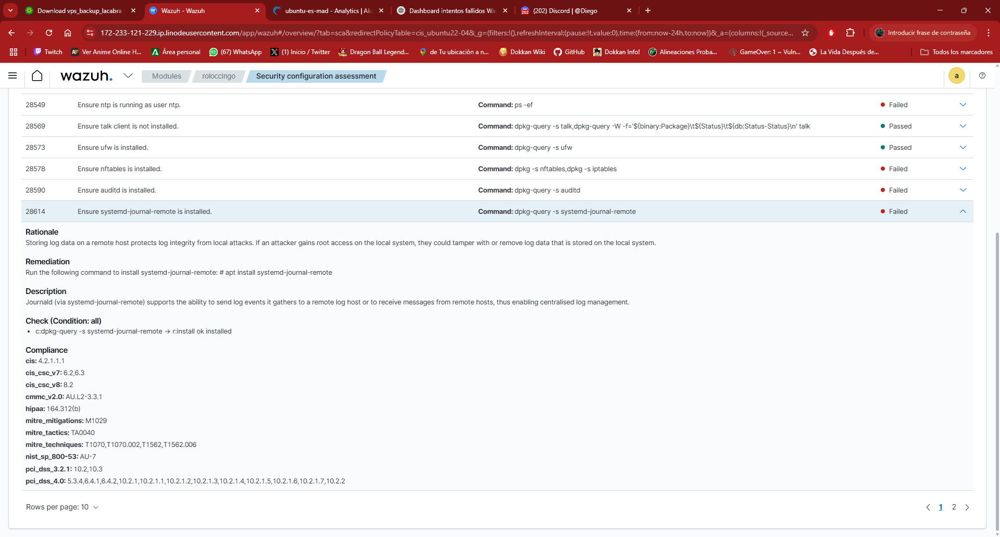
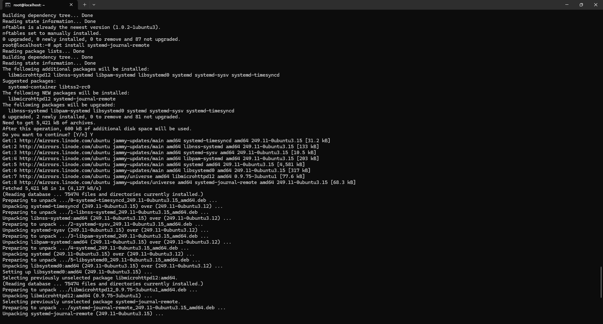

### Corrección de errores gracias al escaner SCA

## Asegurate de que Telnet esta desinstalada




- El comando que necesitamos para asegurarnos de este proceso es:
```
apt purge telnet
```



## Asegurate de que auditd esta instalado




- El comando que necesitamos para asegurarnos de este proceso es:
```
 apt install auditd audispd-plugins
```



## Asegurate de que nftables esta instalado




- El comando que necesitamos para asegurarnos de este proceso es:
```
 apt install nftables
```



En el SCA dice que ese paso estaba failed pero se equivoca, ya que si que estaba instalado

## Asegurate de que este systemd-journal-remote instalado



- El comando que necesitamos para asegurarnos de este proceso es:
```
 apt install systemd-journal-remote
```


